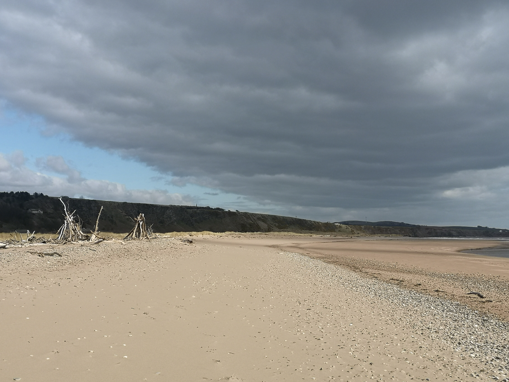
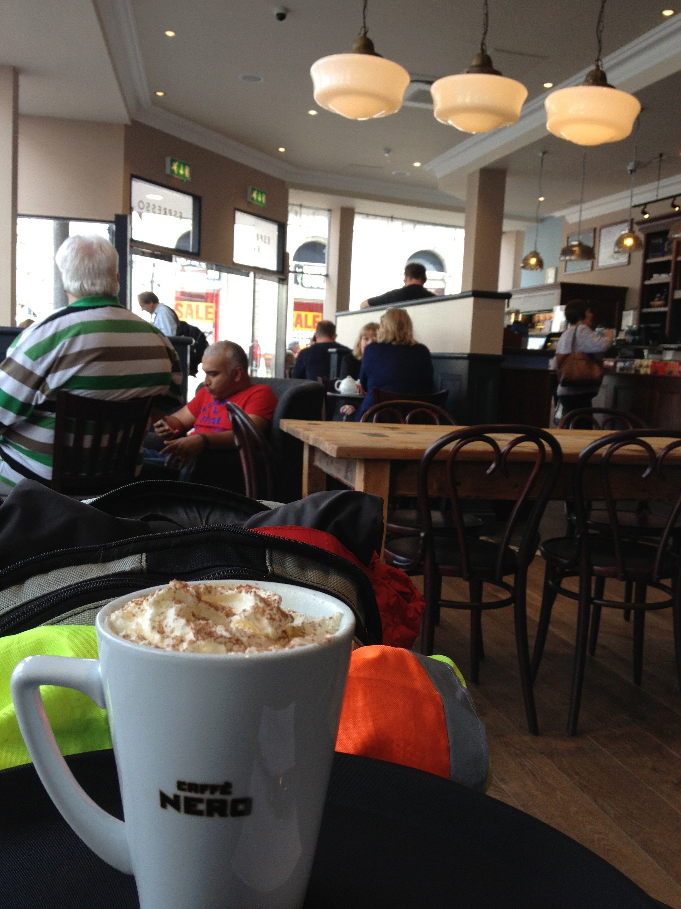
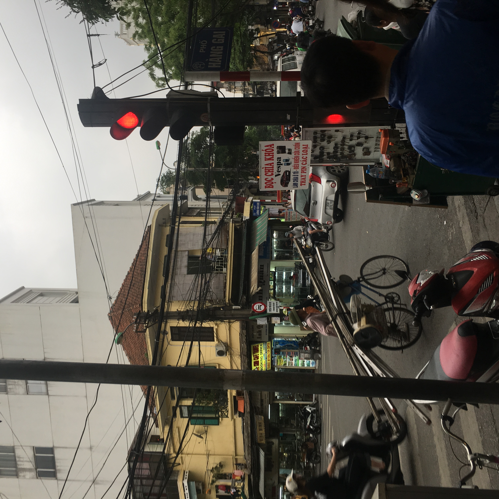

# A Web App Example
A simple web app example highlighting tools and components

## Background 
This is a demo app to see how you might use a variety of development tools to build a modern web application.

## Getting Started
You should have a suitable editor such as [Visual Studio Code](https://code.visualstudio.com), which is useful given its' integrated terminal.
You should also install [Node Package Manager](https://docs.npmjs.com/downloading-and-installing-node-js-and-npm) which you install via Node Version Manager [nvm](https://github.com/nvm-sh/nvm), which also lets you install other tools and libraries to make your work easier. 

Update nvm by rerunning the install command, and use 'npm update -g' to update to the newest version and also update/remove other associated libraries.

## Building the Site
With these in place (or updated as needed, we can move onto putting the folders and files in place. The site will be a quiz site where visitors can see which type of place they like to visit most when they need to recharge their energy to stay healthy. 

You can use the [Mozilla Color Picker Tool](https://developer.mozilla.org/en-US/docs/Web/CSS/CSS_Colors/Color_picker_tool) to determine your colours for the site. Find your colours and then note their RGB, HSL and HEXA values somewhere suitable so that you know them later for use in your CSS files.

Find a font that you want to use at [Google Fonts](https://fonts.google.com). Save the code that you eventually get to, so that you can add the fonts to your site. For example, these are the 'family settings' for Open Sans:

    link rel="preconnect" href="https://fonts.googleapis.com"> 
    <link rel="preconnect" href="https://fonts.gstatic.com" crossorigin> 
    <link href="https://fonts.googleapis.com/css2?family=Open+Sans:wght@300&display=swap" rel="stylesheet">
    CSS rules to specify families
    font-family: 'Open Sans', sans-serif;

This has an Apache licence, so it's free to use. https://fonts.google.com/specimen/Open+Sans#license 

## Starting the HTML 
After we start to write the index.html file we should start to put some testing tools into place so that we're sure our html is valid and accessible. We can add [linthtml](https://github.com/linthtml/linthtml) with the command 

        npm install @linthtml/linthtml --save-dev

The --save-dev option tells npm that we only want this included for our development side of the work, and should not be included in production. Now we need to add a configuration file, which we generate with the command: 

        npx linthtml --init

Pick the format, you prefer, and then add the file to your git repo. Now we can run the linter with the command:

        npx linthtml 'index.html'

After we run this, we can see that the file is ok with no errors. There is also a version of this that integrates into VS Code so that you can see errors as you make them when coding up your html files. You'll find it in the 'extensions' menu on the far-left of the application. 

As as last step in this stage we can create a default package.json file with the command:

        npm init --yes

This will check your folder details and any git settings to add appropriate details. Now you can edit it accordingly, by adding your name in the empty author setting.

## Issues with Images
While we can easily add an image with image tag, we also need to consider the image display size, and the alternative text that is used if images are turned off, or used with a screen reader. We can either edit the photo to the size we want, and/or add dimensions to the img tag. If we open the index.html file without any dimension values in the img tag, we can see the problem.

If we change the img take to be like this, and then reload the page, then it resizes the images for display based on the width so that the height is relative. Yes, we're using table for now. We'll change this later.

        <table><tr>
        <td>
Beach
</td>
        <td>
Cafe
</td>
        </tr><tr>
        <td>
Culture
</td>
        <td>
City Life 
</td>
        </tr><tr>
        <td>
Forest
</td>
        <td>
Mountains
</td>
        </tr></table>

However, this is still using the full image in the background, so if the filesize mattered, then we'd want to resize the images to be 300 pixels wide (or whatever we decided to use). We could use [Gimp](https://www.gimp.org) which is similar to Photoshop, but free as an open source application, so works across different platforms. It will work fine for resizing, and creating images to use for applications.

## Loading pages with a web server
While we can load the pages in the browser straight from the folder, as the application grows, it would be better to have them served from a small web server so that we can experience their flow and connections as our web page visitors will later. We can instll [http-server](https://www.npmjs.com/package/http-server) as a small and lightweight web server to use for testing our pages. 

We can use this command to run the server from the root of our directory and therefore server up the pages using our file and folder structure. Use this command in the terminal:

        npx http-server 

This will start the server in the current directory and then tell you its URL as 127.0.0.1:8080 which is also known as localhost:8080 which means you'll see the index page there due to the convention that web servers always look for 'index' by default in a folder. You can leave it running as you develop and then refresh the page to see your changes. Use ctrl-c to stop the server.

## Adding Styling with CSS
The page is white and uses a table to hold the images and associated text in place. This is both unexciting, and the table will mess up the presentation of people viewing it on a tablet or mobile. A better version would use CSS elements to style the page in an appropriate manner so that it flows smoothly according to the viewer's device.

One simple option is to use [Bootstrap](https://getbootstrap.com) to handle the CSS for the site, as this will enable responsive page design by default for us. It will also work nicely with our Javascript and we can use as little, or as much as we need as the application grows and develops.

While we could use a CDN (content delivery network) and pull the bootstrap files from the link, we'll instead download the zip file, and extract the two basic files that we need for now. Click the 'download' link, and unpack the zip file somewhere other than in the project. We only need a few files.

We now can take the basic minified CSS and JS files to add to our 'assets' folder as our next step. Create an assets/css folder and and assets/js folder. In the 'css' folder put the 'bootstrap.min.css' file, and in the 'js' folder put the 'bootstrap.bundle.min.js' file. Both of these are minimised files for faster loading. Also add the folders and files to your git repo too.

We'll use a custom.css file to hold the site specific css settings so that we avoid editing the bootstrap css file. This makes it easier to upgrade to future bootstrap versions, while also making any future changes easier too.

Now that we're using CSS we should also add a linter to test our stylesheets for correctness. We can do that by using [Stylelint](https://github.com/stylelint/stylelint/blob/master/docs/user-guide/get-started.md) which we can install with the command:

    npm install --save-dev stylelint stylelint-config-standard

We also need to add a configuration file called .styleintrc.json, and it should include the following:

    {
    "extends": "stylelint-config-standard"
    }

We can run this with the command:

    npx stylelint "**/*.css"

This works fine, but as the bootstrap file is minimised, it breaks lots of formating rules, so we add an ignore file to skip linting the file. You can find this and other examples, at the [stylelint](https://stylelint.io) homepage.

## Making the page responsive
At the moment the page is not responsive as we use a table for our formatting, which is ALWAYS a bad idea. Tables use too many characters, and force their layout on the device reading the page, so that people might need to scroll sideways. We should use bootstrap library components to remove the table.

The simplest option is to swap the table element for 'container' and the tr for 'row' and cells for 'col' which let us take advantage of the [flexbox](https://getbootstrap.com/docs/4.6/layout/grid/) layout in Bootstrap.

        

        

Beach
            
            

        

Cafe
            
            

        

Culture
            
        

        

City Life
            
            

        

Forest
            
        

        

Mountains
            
        

        

Now if you reload the page, and then narrow the browser width you'll see the page reformat itself into a single column with six items. Much better. The grid takes over the whole page now too, which means our space it better utilised. Just to be safe, we can also run the html and css linters to see if we made any mistakes.
 
 ### Fixing Page Banner
 We currently do notbing with the page space above the images. It is not centred, or have a background colour. We can use bootstrap basics to make it more inviting. We can use ['jumbotron'](https://getbootstrap.com/docs/4.6/components/jumbotron/) to do this for us, and use 'jumbotron text-center' as the class to centre the containter.

## Moving onto the javascript parts
For interaction with the quiz we need a 'form' and a scripting language that apply the 'quiz logic' for us. To stay within the browser we'll use a javascript file to hold that logic, which will load with the page. After it runs we'll display the result on the same page.

We'll refactor this [quiz example](https://www.sitepoint.com/simple-javascript-quiz/) to suit our needs. 

Adding in some texting with Jest should happen too.
